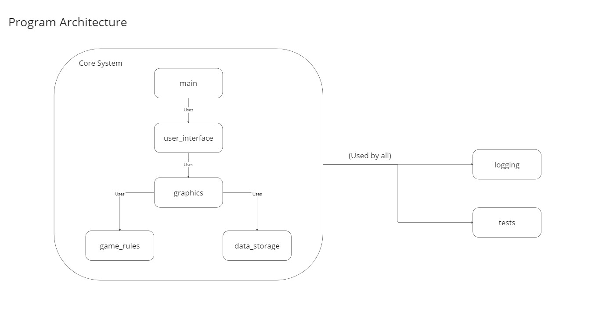

# About

This is a repository for the recreation of the "Nibbles", outlined on [this page](https://inventwithpython.com/blog/2012/02/20/i-need-practice-programming-49-ideas-for-game-clones-to-code/). More information below.

More available in the [architectural details](#architectural-details) section of this page.

# Installation and Usage

__Installation__

1. This program was developed using [Python 3.8](https://www.python.org/downloads/release/python-386/). For this reason it is recommended the user has installed at least that version of python in order for the program to run, but this may work fine on earlier versions of Python
2. It's recommended the user then create a python virtual environmemnt in this root directory via `python -m venv venv`
3. Once the virtual environment is activated, please run a `pip install -r requirements.txt` for the [`requirements.txt`](requirements.txt) file in here in root directory

__Starting the Game__

The game may be run via executing `python 'program/main.py'` at the root location of this repository.

# Architecture

## Details

__`user_interface` Package__

The `user_interface` is responsible for managing the screens each user sees and for loading and unloading graphics elements for each screen. The UI also sets event listeners and overall rules for human interface with the game.

__`graphics` Package__

The `graphics` package is responsible for constructing and managing movement of individual game entities. The UI sets the event listener but the graphics package determines what the game elements do upon an event.

__`gamerules` Package__

The `gamerules` package determines how the game is scored and is also used to determine whether the game is in a won/lost state. This package should not communicate directly with the main game loop but rather communicate via the `graphics` engine.

__`data_storage` Package__

The `data_storage` is the interface for how the program communicates with the database.

__`logging` Package__

The `logging` package provides utilities for logging application activity to enable more robust and effective debugging.